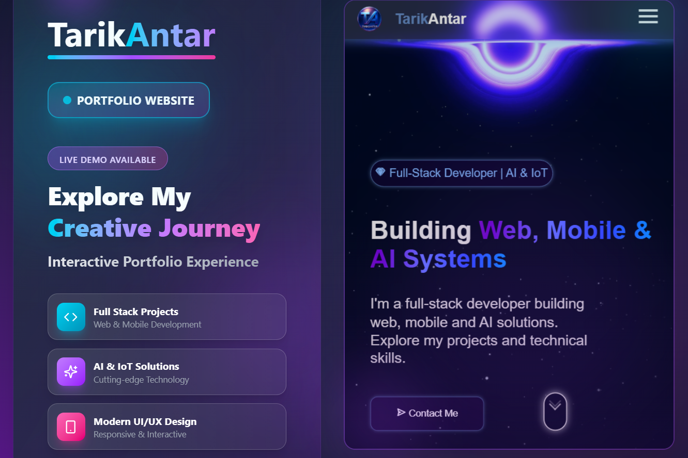

# Tarik Antar | Full-Stack Developer Portfolio 🌐

Welcome to my personal portfolio website! This is the place where I showcase my journey as a **Full-Stack Developer**, specializing in **AI**, **IoT**, and modern web and mobile applications.

---

## About Me

Hi, I'm **Tarik Antar**. I have hands-on experience in building **web, mobile, and AI-powered solutions**. My background combine **full-stack development with IoT, embedded systems**, and **AI programming**, allowing me to design **scalable, intelligent, and interactive solutions** that bridge software and hardware.

This portfolio demonstrates my skills, projects, and ongoing work. I continuously update it as I complete new projects or enhance existing ones, so some of my latest work may not yet be live on the website — but it’s always in progress!

---

## Technologies & Skills

I work with a wide range of languages, frameworks, and tools, including:

- **Frontend:** HTML, CSS, JavaScript, React, Bootstrap, WordPress
- **Backend:** Node.js, Express.js, REST APIs  
- **Databases:** MongoDB, MySQL, Supabase  
- **Cloud & DevOps:** AWS, Docker  
- **AI & IoT:** Python, Machine Learning, IoT device integration, C++, Arduino, Raspberry Pi, Linux
- **Design & Dev Tools:** Figma, Postman, VS Code  

---

## Projects

You can explore my projects directly on this website. They include:

- **Web Applications** – Interactive and responsive websites  
- **Mobile Apps** – Cross-platform mobile development  
- **AI & IoT Systems** – Intelligent solutions integrating hardware and software  

> Note: Some projects I’ve completed may not yet be reflected on the live website. I continuously update the portfolio as I finalize them.

---

## Continuous Updates

This portfolio is **actively maintained**. Every new project I complete, every improvement I make, will be reflected here, ensuring visitors always see my **latest and best work**.

---

## Connect With Me

You can find me and follow my work here:

- [GitHub](#)  
- [LinkedIn](#)  
- [Telegram](#)  

---

Thank you for visiting my portfolio!  
Feel free to explore my projects and **get in touch** if you’d like to collaborate or discuss opportunities.